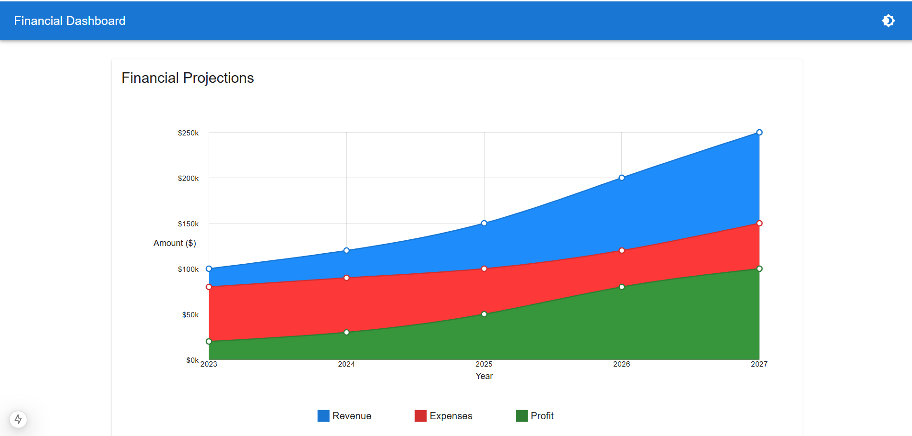
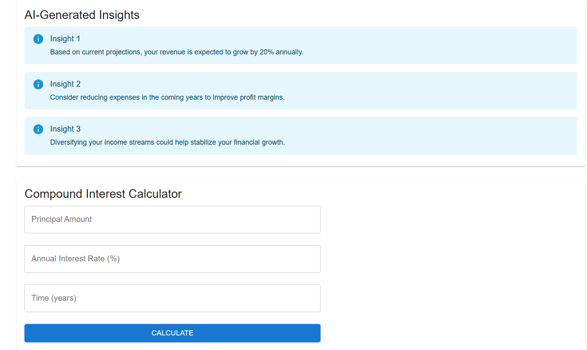

# Financial Dashboard

A modern, responsive financial dashboard built with Next.js and Material-UI, featuring interactive charts, financial insights, and a compound interest calculator. This project combines powerful data visualization with a clean, professional user interface to help users better understand their financial data.




## Core Features

### 📈 Financial Projections
- Interactive line charts showing revenue, expenses, and profit trends
- Responsive design with smooth animations
- Custom tooltips and grid styling
- Dark/Light theme support

### 💡 AI-Generated Insights
- Automated financial analysis
- Key trend identification
- Actionable recommendations

### 🧮 Compound Interest Calculator
- Real-time calculations
- User-friendly input fields
- Clear result display

## Tech Stack
- **Framework**: [Next.js 15](https://nextjs.org/)
- **UI Library**: [Material-UI v6](https://mui.com/)
- **Charts**: [@mui/x-charts](https://mui.com/x/react-charts/)
- **Styling**: [Tailwind CSS](https://tailwindcss.com/)
- **Language**: [TypeScript](https://www.typescriptlang.org/)
- **Theme**: Dark/Light mode with system preference support

## Project Structure```
data-dashboard/
├── app/
│   ├── dashboard/
│   ├── layout.tsx
│   └── page.tsx
├── components/
│   ├── FinancialProjections.tsx
│   ├── FinancialInsights.tsx
│   ├── FinancialCalculator.tsx
│   ├── Layout.tsx
│   ├── ThemeToggle.tsx
│   └── theme-provider.tsx
└── [configuration files]```

## Getting Started

### Prerequisites
- Node.js (Latest LTS version recommended)
- npm or yarn or pnpm

### Installation

1. Clone the repository```bash
git clone [your-repo-url]```

2. Install dependencies
```bash
npm install
# or
yarn install
# or
pnpm install
```

3. Run the development server
```bash
npm run dev
# or
yarn dev
```

4. Open [http://localhost:3000](http://localhost:3000) with your browser to see the result.

## Features in Detail

### Financial Projections Chart
- Multi-line chart displaying revenue, expenses, and profit
- Custom styling and animations
- Responsive design
- Interactive tooltips
- Grid customization

### Financial Insights
- AI-generated analysis (currently using mock data)
- Clean, alert-based presentation
- Easy-to-understand format

### Compound Interest Calculator
- Real-time calculations
- Input validation
- Clear result display
- Responsive design

## Roadmap

### Implemented ✅
- Basic dashboard layout
- Financial projections chart
- Theme switching functionality
- Compound interest calculator
- Financial insights component
- Responsive design

### Planned Features 🚀
- [ ] Real data integration
- [ ] User authentication
- [ ] Data export functionality
- [ ] More financial calculators
- [ ] Custom chart configurations
- [ ] API integration for real-time data
- [ ] User preferences storage
- [ ] PDF report generation

## Contributing
Contributions are welcome! Please feel free to submit a Pull Request.

## License
[Add your license here]

## Contact
[Add your contact information here]

---
Built with 💙 using Next.js and Material-UI


